# 모든 영화,TV프로그램의 정보 #리뷰어스
##### 팀원 : 박진우(조장), 김진원, 박성범, 문영석
## Contetns
1. [기획 의도](#기획-의도)
2. [설계의 주안점](#설계의-주안점)
3. [사용기술 및 개발환경](#사용기술-및-개발환경)
4. [주요기능](#주요기능)
5. [Document](#Document)
___
## 기획 의도
- 여러개의 플랫봄에서 이용되는 컨텐츠 들의 리뷰를 하나의 사이트에서 보고 싶다.
- 누구나 리뷰를 할 수 있어야한다.
- 국내의 리뷰 사이트들은 어딘가에 종속되어 운영된다

___
## 설계의 주안점
1. **spring security**을 이용한 비밀번호 암호화 저장
2. 회원가입,아이디 찾기, 비밀번호 변경 시 **JavaMail**를 인증번호를 전송
4. **oAuth2.0**를 이용한 네이버, 구글 소셜 로그인 구현 
5. **open source**를 이용해 글 작성시 태그 서비스와 text editor 구현
6. **openAPI**을 이용한 다양한 영화와 TV프로그램 정보들의 활용
7. **Ajax**를 활용하여 회원 비회원 구분 및 댓글 시스템 구현
8. **autocomplete jquery**을 이용한 자동 검색어 자동 완료기능 구현

___
## 사용기술 및 개발환경

    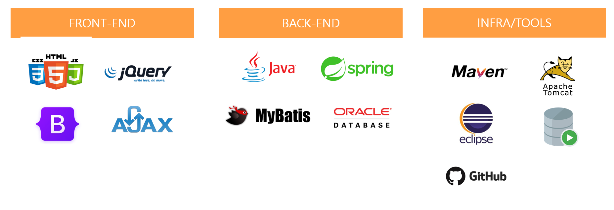

___

## 주요기능

**1. 메인화면**

    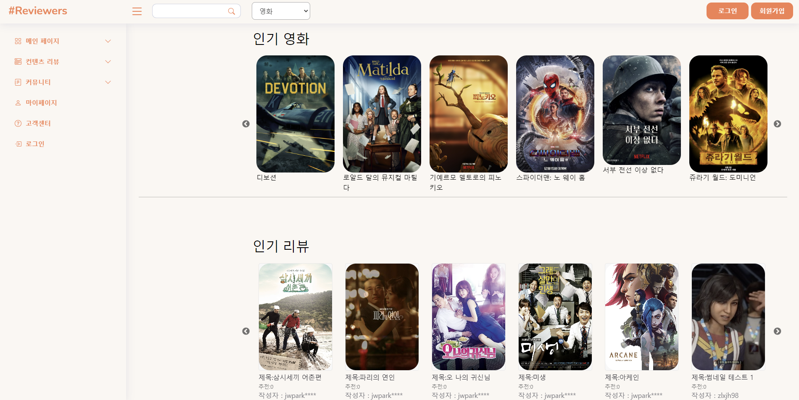

**2. 회원가입**

    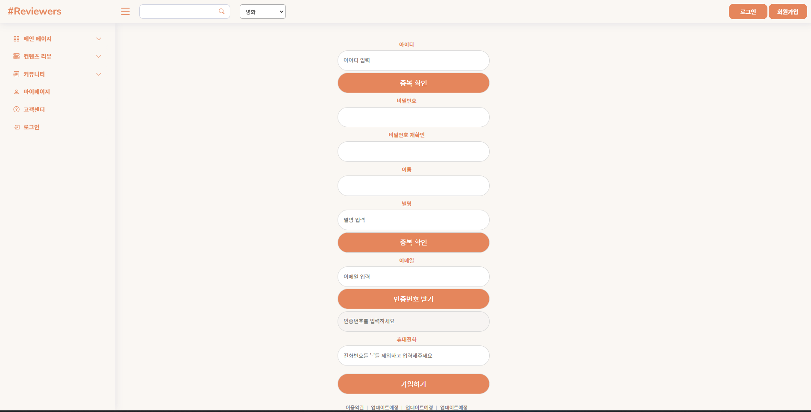

**3. 컨텐츠 상세정보**

    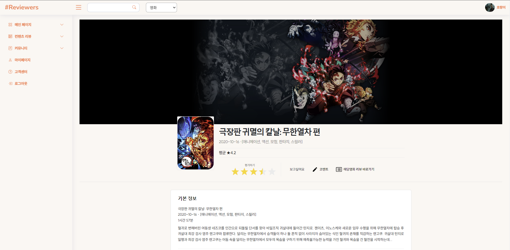
    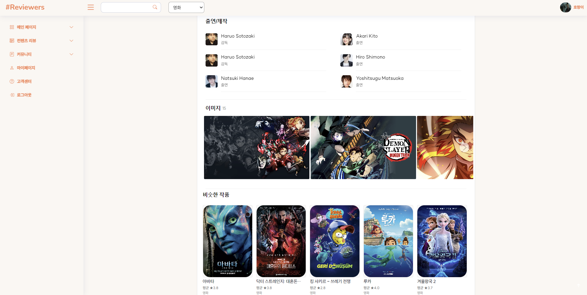

**4. 콘텐츠 코멘트**

    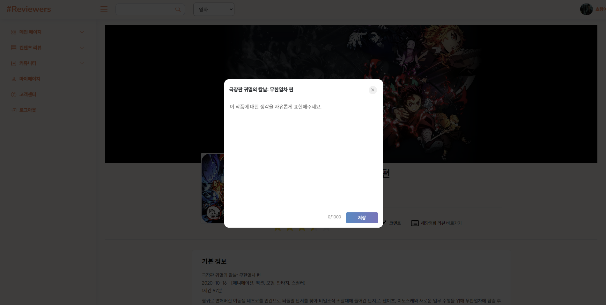
    

**5. 전체 리뷰 보기**

    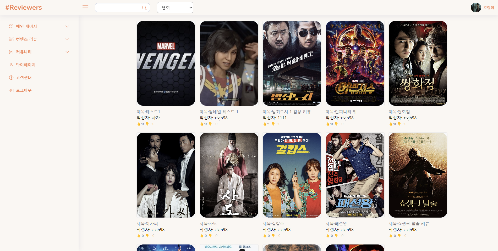

**6. 글 작성 하기**

    
    

**7. 댓글 작성하기**

    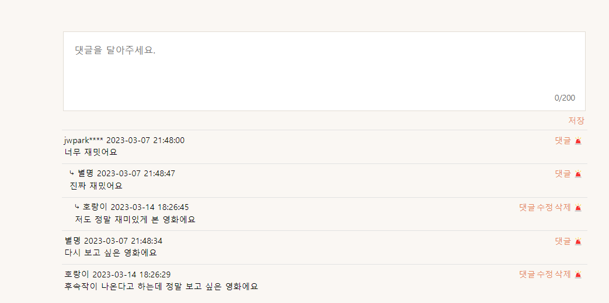

**8. 신고하기**

    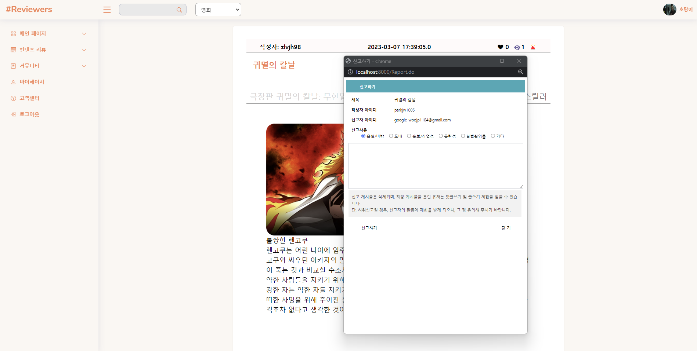

**9. 마이페이지**

    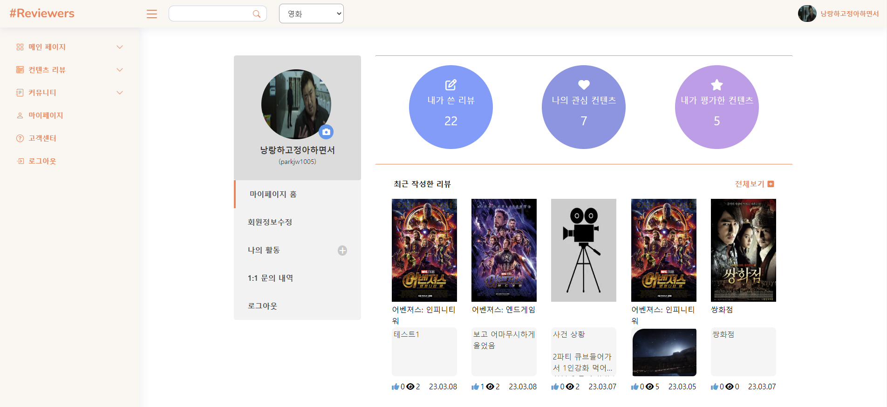
    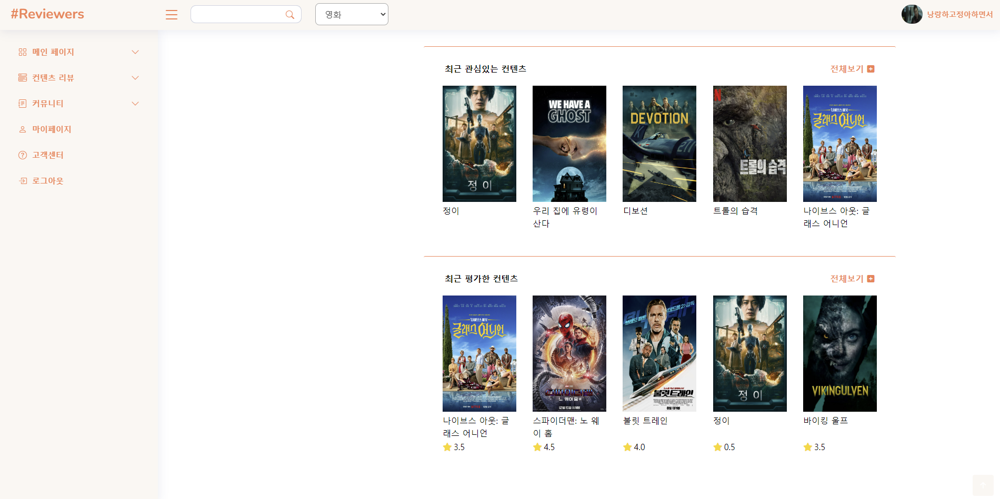

**10. 회원 정보수정**

    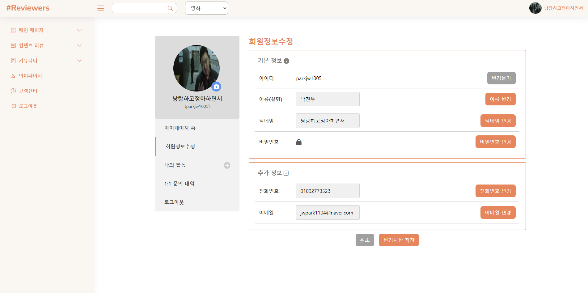

**11. FAQ**

    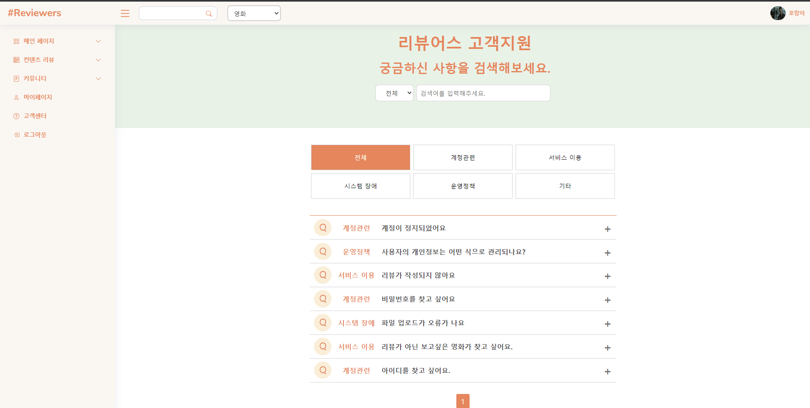

